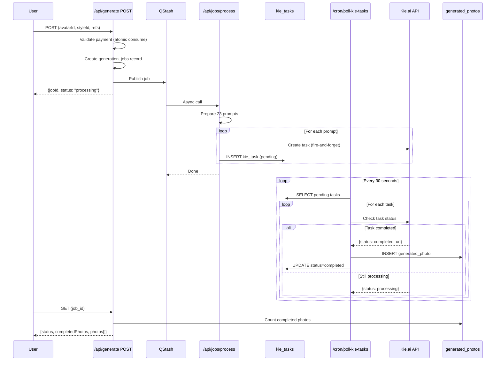

# Async AI Photo Generation Architecture

**Status:** Production
**Last Updated:** 2026-01-05

## Overview

PinGlass uses a fire-and-forget async architecture for AI photo generation. This is necessitated by Vercel's 100-second function timeout limit, while a full 23-photo generation takes 5-10 minutes.

## Why Fire-and-Forget?

| Constraint | Limit | Impact |
|------------|-------|--------|
| Vercel Function Timeout | 100s | Cannot complete generation synchronously |
| Kie.ai Per-Image Time | 10-30s | x23 = 230-690s total |
| User Experience | Immediate | Must return immediately with job ID |

**Solution:** Queue generation tasks, return immediately, poll for completion.

## System Components

```
┌─────────────┐     ┌─────────────┐     ┌─────────────┐
│   Client    │────▶│  /api/      │────▶│   QStash    │
│  (Browser)  │     │  generate   │     │   Queue     │
└─────────────┘     └─────────────┘     └──────┬──────┘
       │                                        │
       │ Poll status                            │ Async call
       ▼                                        ▼
┌─────────────┐     ┌─────────────┐     ┌─────────────┐
│  /api/      │◀────│  Neon DB    │◀────│  /api/jobs  │
│  generate   │     │  (status)   │     │  /process   │
│  GET        │     └─────────────┘     └──────┬──────┘
└─────────────┘                                 │
                                                │ Create tasks
                                                ▼
                                         ┌─────────────┐
                                         │  kie_tasks  │
                                         │   table     │
                                         └──────┬──────┘
                                                │
                                                │ Polled by
                                                ▼
                                         ┌─────────────┐
                                         │ /api/cron/  │
                                         │ poll-kie-   │
                                         │ tasks       │
                                         └──────┬──────┘
                                                │
                                                │ Check status
                                                ▼
                                         ┌─────────────┐
                                         │   Kie.ai    │
                                         │    API      │
                                         └─────────────┘
```

## Sequence Diagram



## Database Tables

### generation_jobs
Main job tracking table.

```sql
CREATE TABLE generation_jobs (
  id SERIAL PRIMARY KEY,
  avatar_id INTEGER REFERENCES avatars(id),
  style_id VARCHAR(50),
  status VARCHAR(20) DEFAULT 'pending',  -- pending, processing, completed, failed
  total_photos INTEGER DEFAULT 23,
  completed_photos INTEGER DEFAULT 0,
  payment_id INTEGER REFERENCES payments(id),
  error_message TEXT,
  created_at TIMESTAMP DEFAULT NOW(),
  updated_at TIMESTAMP DEFAULT NOW()
);
```

### kie_tasks
Per-image task tracking for Kie.ai async polling.

```sql
CREATE TABLE kie_tasks (
  id SERIAL PRIMARY KEY,
  job_id INTEGER REFERENCES generation_jobs(id),
  avatar_id INTEGER REFERENCES avatars(id),
  kie_task_id VARCHAR(255) NOT NULL,     -- Kie.ai task UUID
  prompt TEXT NOT NULL,
  prompt_index INTEGER,
  style_id VARCHAR(50),
  status VARCHAR(20) DEFAULT 'pending',   -- pending, completed, failed
  result_url TEXT,
  attempts INTEGER DEFAULT 0,
  max_attempts INTEGER DEFAULT 10,
  created_at TIMESTAMP DEFAULT NOW(),
  updated_at TIMESTAMP DEFAULT NOW()
);

CREATE INDEX idx_kie_tasks_status ON kie_tasks(status);
CREATE INDEX idx_kie_tasks_job ON kie_tasks(job_id);
```

### generated_photos
Final results storage.

```sql
CREATE TABLE generated_photos (
  id SERIAL PRIMARY KEY,
  avatar_id INTEGER REFERENCES avatars(id),
  style_id VARCHAR(50),
  prompt TEXT,
  image_url TEXT NOT NULL,
  created_at TIMESTAMP DEFAULT NOW()
);
```

## Key Files

| File | Purpose |
|------|---------|
| `app/api/generate/route.ts` | Entry point, payment validation, QStash publish |
| `app/api/jobs/process/route.ts` | QStash handler, creates kie_tasks |
| `app/api/cron/poll-kie-tasks/route.ts` | Polls Kie.ai, saves results |
| `lib/kie.ts` | Kie.ai API wrapper |
| `lib/qstash.ts` | QStash publishing utilities |

## Job Lifecycle

```
┌──────────┐     ┌────────────┐     ┌───────────┐     ┌───────────┐
│ pending  │────▶│ processing │────▶│ completed │     │  failed   │
└──────────┘     └────────────┘     └───────────┘     └───────────┘
     │                  │                                   ▲
     │                  │                                   │
     │                  └───────────────────────────────────┘
     │                        (error or max attempts)
     │
     └─────────────────────────────────────────────────────▶
                    (QStash publish failed)
```

### Status Transitions

1. **pending** -> **processing**: QStash job starts
2. **processing** -> **completed**: All kie_tasks completed
3. **processing** -> **failed**: Error or timeout
4. **pending** -> **failed**: QStash publish failed (auto-refund triggered)

## Error Handling

### QStash Failure
```typescript
// In /api/generate/route.ts
if (!qstashResult) {
  // Mark job as failed
  await sql`UPDATE generation_jobs SET status = 'failed' WHERE id = ${job.id}`

  // Auto-refund payment
  const refundResult = await autoRefundForFailedGeneration(avatarId, userId)

  return error("QUEUE_FAILED", "Failed to start generation. Payment refunded.")
}
```

### Kie.ai Task Failure
```typescript
// In /cron/poll-kie-tasks/route.ts
if (task.attempts >= task.max_attempts) {
  await sql`UPDATE kie_tasks SET status = 'failed' WHERE id = ${task.id}`
  // Job continues with remaining photos
}
```

### Stuck Job Detection
Cron job `/api/cron/check-stuck-jobs` runs every 5 minutes:
- Jobs in `processing` for >30 minutes -> mark as `failed`
- Trigger notification to admin

## QStash Configuration

```typescript
// lib/qstash.ts
export const QSTASH_CONFIG = {
  CHUNK_SIZE: 23,           // Process all photos in one chunk
  MAX_RETRIES: 3,           // QStash will retry on failure
  RETRY_DELAY: 30,          // 30 seconds between retries
}
```

## Cron Schedule

| Endpoint | Schedule | Purpose |
|----------|----------|---------|
| `/api/cron/poll-kie-tasks` | Every 30s | Check Kie.ai task status |
| `/api/cron/check-stuck-jobs` | Every 5min | Detect stuck generations |
| `/api/cron/cleanup-old-tasks` | Daily | Clean up old kie_tasks records |

## Performance Considerations

### Why Not Batch Multiple Photos?
Kie.ai doesn't support batch generation with the same reference images. Each photo requires a separate API call.

### Why 30-Second Polling?
- Kie.ai typical completion: 15-45 seconds
- Balance between responsiveness and API rate limits
- Reduces database load vs continuous polling

### Idempotency
QStash may retry on network issues. We use `upstash-message-id` header for deduplication:

```typescript
const messageId = request.headers.get("upstash-message-id")
const existing = await sql`
  SELECT id FROM qstash_processed_messages WHERE message_id = ${messageId}
`
if (existing.length > 0) {
  return { success: true, duplicate: true }
}
```

## Monitoring

### Key Metrics to Watch
- `generation_jobs` with status `processing` > 30min
- `kie_tasks` with attempts > 5
- QStash failure rate
- Average generation completion time

### Admin Dashboard
View at `/admin/generations`:
- Real-time job status
- Per-job task breakdown
- Retry failed tasks manually

## Future Improvements

1. **Parallel Processing**: Currently sequential, could parallelize with multiple QStash messages
2. **Priority Queue**: VIP users get faster processing
3. **Fallback Provider**: Auto-switch to Replicate if Kie.ai fails
4. **Progress Streaming**: WebSocket updates instead of polling
